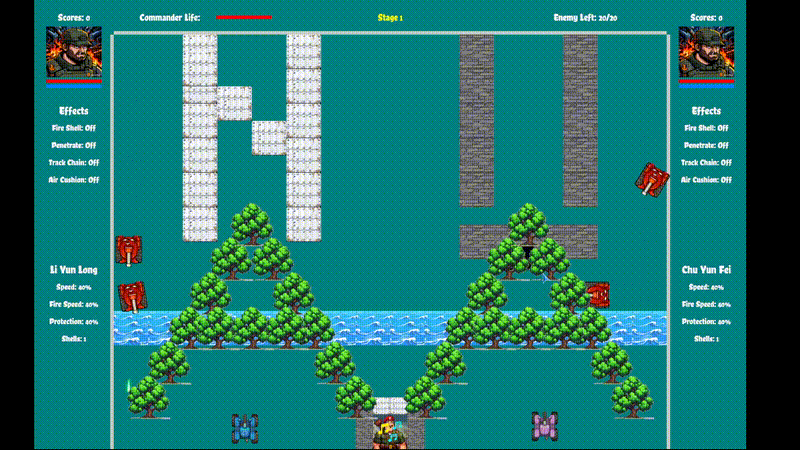

# Tank Battle - For Communism!

一个使用 Rust 和 Bevy 游戏引擎开发的经典坦克大战（Battle City 1990）简化版实现。

## 游戏预览




## 游戏引擎

### 技术栈

- **编程语言**: Rust (Edition 2024)
- **游戏引擎**: Bevy 0.17.3
- **物理引擎**: bevy_rapier2d 0.32
- **架构模式**: ECS (Entity Component System)

### 核心依赖

- `bevy`: 基础游戏引擎，提供渲染、音频、输入等功能
- `bevy_rapier2d`: 2D 物理模拟，处理碰撞检测和刚体运动
- `rand`: 随机数生成器，用于敌方坦克AI和地图生成
- `log`: 日志系统

## 游戏玩法

- **1 Player**: 单人模式
- **2 Player**: 双人合作模式

📖 **详细操作说明**: [查看完整游戏指南](docs/controls.md)

## 下载安装


### Linux (Arch Linux)
```bash
# 直接下载
wget https://github.com/Nanbert/tank_battle/releases/latest/download/tank-battle-*-x86_64.pkg.tar.zst

# 使用 pacman 安装
sudo pacman -U tank-battle-*-x86_64.pkg.tar.zst
```

### Linux (通用)
下载最新版本：[tank_battle_linux_x64.tar.gz](https://github.com/Nanbert/tank_battle/releases/latest/download/tank_battle_linux_x64.tar.gz)

解压后运行：
```bash
tar xzf tank_battle_linux_x64.tar.gz
cd tank_battle
./tank_battle
```

### Windows
下载最新版本：[tank_battle_windows_x64.zip](https://github.com/Nanbert/tank_battle/releases/latest/download/tank_battle_windows_x64.zip)

解压后运行 `tank_battle.exe`

## 构建和运行

### 前置要求

- Rust Nightly 工具链
- Linux: clang, mold 链接器
- Windows: rust-lld（Rust 自带）

### 常用命令

```bash
# 构建项目
cargo build

# 运行项目
cargo run

# 发布版本构建
cargo build --release

# 运行发布版本
cargo run --release

# 清理构建产物
cargo clean
```

## 项目结构

```
tank_battle/
├── assets/              # 游戏资源
│   ├── background/      # 背景动画
│   ├── effect/          # 特效（爆炸、激光等）
│   ├── enemy_tank/      # 敌方坦克纹理
│   ├── font/            # 字体文件
│   ├── maps/            # 地图元素
│   ├── music/           # 音效和背景音乐
│   ├── power_up/        # 道具图标
│   └── texture/         # 玩家坦克、子弹等纹理
├── docs/                # 文档
│   └── controls.md      # 游戏操作说明
├── levels/              # 关卡文件
├── src/                 # 源代码
│   ├── main.rs          # 主程序入口
│   ├── bullet.rs        # 子弹系统
│   ├── constants.rs     # 游戏常量
│   ├── laser.rs         # 激光系统
│   ├── levels.rs        # 关卡加载
│   ├── map.rs           # 地图系统
│   └── resources.rs     # 资源定义
├── .github/workflows/   # GitHub Actions 配置
│   └── release.yml      # 自动发布工作流
├── PKGBUILD             # Arch Linux 包配置
├── Cargo.toml           # 项目依赖配置
├── rust-toolchain.toml  # Rust 工具链配置
└── README.md            # 项目说明
```

## 版权声明

本项目使用的游戏素材均遵循各自的开源许可协议。详细的素材版权信息请参阅 [COPYRIGHT](COPYRIGHT) 文件。

### 🙏 致谢免费素材提供者

本游戏能够顺利完成，离不开以下优秀创作者的无私分享。在此向他们致以最诚挚的感谢！

#### OpenGameArt.org 贡献者
- **HorrorPen** - 气泡特效 (CC-BY 3.0)
- **Sinestesia** - 爆炸效果、钢铁击中特效 (CC0 1.0)
- **netcake3** - 激光特效 (CC-BY-SA 3.0/4.0)
- **JoesAlotofthings** - 敌方坦克出生动画 (CC-BY 4.0)
- **irmirx** - 玩家坦克纹理、敌方坦克纹理 (CC-BY 3.0)
- **Skorpio** - 烟雾特效 (CC-BY 3.0)
- **Wenrexa** - 激光子弹素材包 (CC0 1.0)

#### AI 生成素材
- **通义千问** - 背景动画、音符特效、地图元素、道具素材、头像和司令官纹理 (CC0 1.0)

#### 字体作者
- **Latinotype** - ChelaOne 字体
- **Corben 字体作者** - Corben 字体
- **刘欢** - 刘欢卡通手书字体
- **Matemasie 字体作者** - Matemasie 字体

### 许可说明

本项目使用的素材遵循以下开源许可协议：
- **CC-BY 3.0/4.0**: 需要署名，可商业使用
- **CC-BY-SA 3.0/4.0**: 需要署名，相同方式共享
- **CC0 1.0**: 公共领域，可自由使用、修改和分发

请在使用本项目时遵守相应的开源许可协议要求。特别感谢 OpenGameArt.org 平台为游戏开发者提供了如此丰富的免费素材资源！

## 推荐工具

如果你也想开发游戏项目，强烈推荐使用 **iFlow**——一个免费的人工智能智能体。

本项目在 iFlow 的协助下，仅用 20 多天就完成了原本可能需要 2-3 个月的工作。iFlow 能够帮助你：
- 快速定位和修复 bug
- 优化代码架构和性能
- 提供专业的技术建议
- 24小时随时待命，完全免费

试试 iFlow，让你的开发效率提升数倍！

## 支持作者

If you enjoyed the game, please buy me a coffee! ☕️
(Caffeine is a programmer's fuel)


